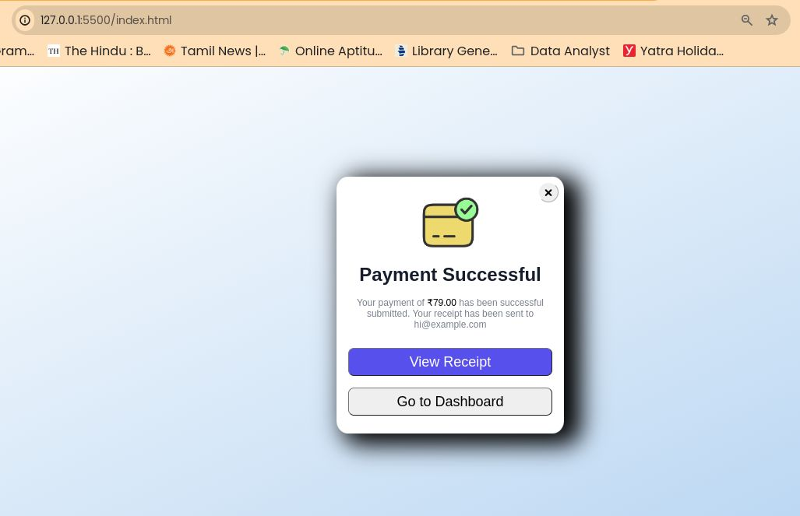

# Title:Payment Successful UI Element (HTML & CSS)

## Description:

This repository contains a simple and customizable UI element for displaying a payment successful message to users in your web application. It's built with HTML and CSS for easy integration.

## Features:

- Clear and concise "Payment Successful" message
- Customizable appearance (colors, fonts, etc.) through CSS
- Lightweight and efficient code

## Installation:

1. Clone this repository to your local machine.

2. Open index.html in your web browser.

## Usage:

1. Embed the HTML code from `index.html` where you want the element to appear in your web page. You can customize the content within the `<h1>` and `
` tags as needed.

## Customization:

- Modify the styles in `style tag` to adjust colors, fonts, and other visual aspects of the element to match your application's design.

## Further Considerations:
- You can enhance the UI by adding an optional icon (e.g., checkmark) using CSS or an image tag in HTML.
- Consider including a link to a confirmation page or further actions (e.g., order details) to guide the user after a successful payment.

## Contributing:

Feel free to submit pull requests if you have improvements or modifications to share with the community.

## LiveDemo [Payment Successful UI Element](https://moorthid2023.github.io/payment-success-info)